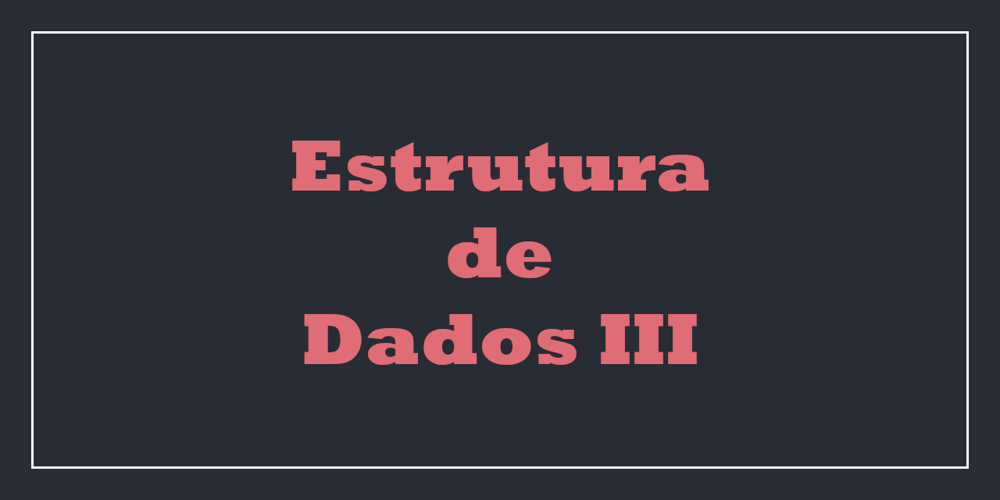

  Neste Repositorio estão os trabalhos, feitos em dupla, durante a disciplina de Estrutura de Dados III (SCC0607), 
  lecionada pela Docente Cristina Dutra de Aguiar, para o curso de Engenharia de Computação - USP São Carlos.

# Trabalhos

## Trabalho 00 [(Clique Aqui)](Trabalho%200)

Trabalho para a familiarização com o uso de arquivos binários em C.

## Trabalho 01 [(Clique Aqui)](Trabalho%20Pratico%201)

Implementação de um arquivo de dados.

## Trabalho 02 [(Clique Aqui)](Trabalho%20Pratico%202)

Implementação de um arquivo de indice.

## Trabalho 03 [(Clique Aqui)](Trabalho%20Pratico%203)

Implementação de um grafo.

# Autores

<table>
  <tr align="center">
    <td>
      <a alt="nicholasestevao GitHub" href="https://github.com/nicholasestevao">
      
       
      Nicholas Estevão
      </a>
    </td>
    <td>
      <a alt="ISS2718 GitHub" href="https://github.com/ISS2718">
        
         
        Isaac Soares
      </a>
    </td>
  </tr>
</table>

 # License
 
[MIT License](https://github.com/nicholasestevao/TrabalhosEDIII/blob/master/LICENSE) © [nicholasestevao](https://github.com/nicholasestevao)
